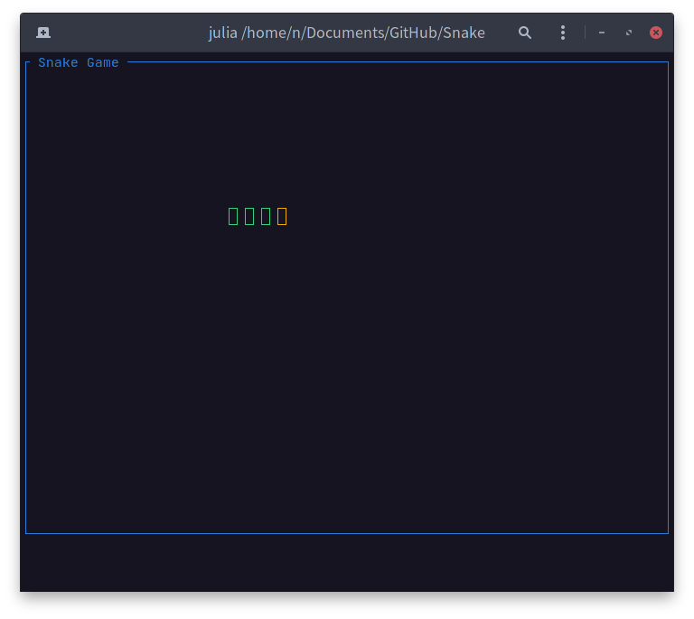

<h1 align="center">
    
    <br>
</h1>

# Snake Game

This snake game demonstrates how to build an application using [`Terming.jl`](https://github.com/foldfelis/Terming.jl) as backend.

## Quick start

The package can be installed with the Julia package manager. From the Julia REPL, type ] to enter the Pkg REPL mode and run:

```julia
Pkg> add https://github.com/foldfelis/Snake.jl
```

To start the game, simply execute `main()` function.

```julia
julia> using Snake

julia> main()
```

## How to play

Use `Up`, `Down`, `Right` and `Left` key to control snake movement, press `ESC` to quit.
